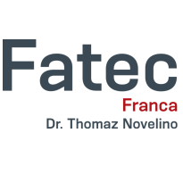

# Hello, my name is Artur!

  

  

  👨‍🎓 Systems Analysis and Development Student   
  💬 Always keep learning...   
  💌 Contact me: ⤵️   

  

  

  

  

## 🚀 My main skills

 

## <b>📘 Academic education </b>

  

  

  **Systems Analysis and Development**  
  [**Fatec Franca - Faculdade de Tecnologia "Dr. Thomaz Novelino"​**](https://site.fatecfranca.edu.br)  
  Fev/2022 > Dec/2024  
  Higher education
  

  

## ➕ Additional Information

* Willingness and ease in learning.
